# Шаблон проекта микросервиса построенного на базе Asp.Net Core WebApi

## Установка шаблона

#### 1 В консоли перейти в корень проекта **Microservice Run** (там где расположен `Microservice.sln`).

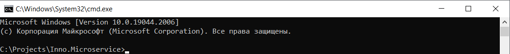

### 2 Выполнить команду `dotnet new --install .`

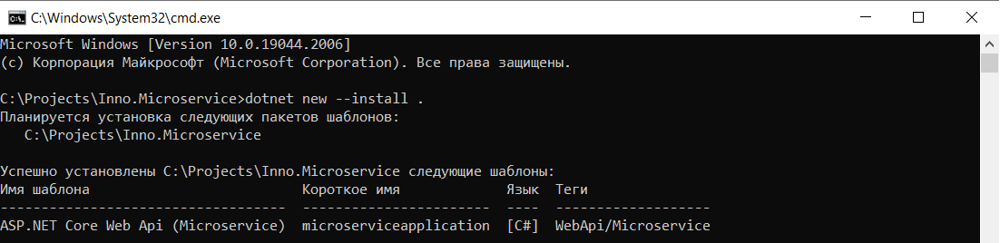

### 3 Выполнить команду `dotnet new --list .` и убедиться, что шаблон присутствует в списке доступных.

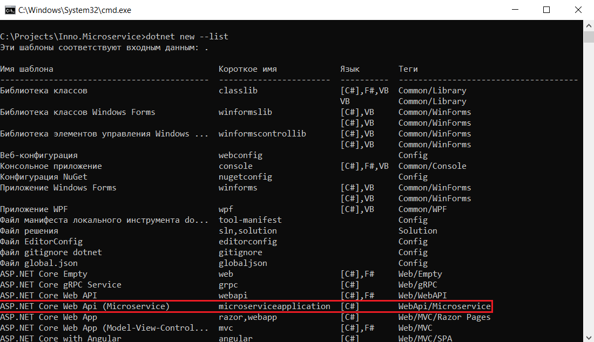

### 3.1 Установленный шаблон также будет доступен в списке шаблонов Visual Studio.

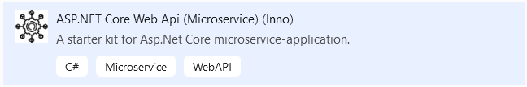

## Создание проекта на примере Visual Studio

#### 1 Запустить Visual Studio, выбрать **Create a new project**.

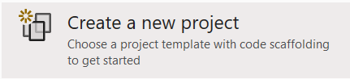

#### 2 В списке шаблонов выбрать **ASP.NET Core Web Api (Microservice)**.

#### 3 Указать имя проекта, например: **MyMicroservice1** и установить опцию: **Place solution and project in the same directory**.

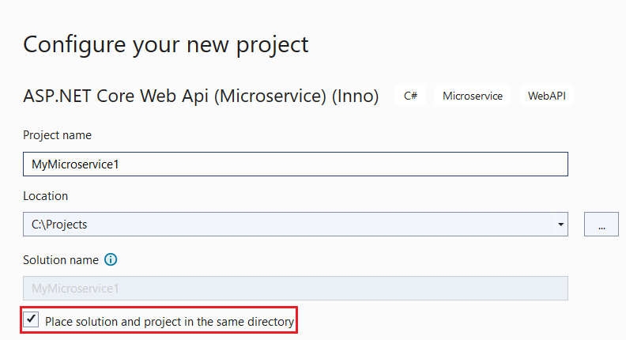

#### 4 В результате будет создан проект микросервиса. В качестве **Startup Project** необходимо выбрать проект: **MyMicroservice1.WebApi**.

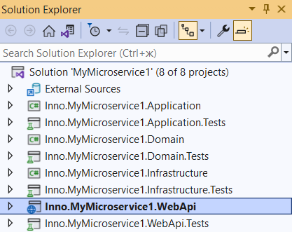

#### 5 Установить миграции, для этого переходим: **View - Other Windows - Package Manager Console**. В качестве **Default project** выбираем **MyMicroservice1.Infrastructure** и выполняем команду: **Update-database**. По умолчанию будет использоваться сервер БД на **localhost:5432**, а в качестве имени БД использоваться имя проекта, которое мы указывали на **шаге 3**, в нашем случае: **MyMicroservice1**.

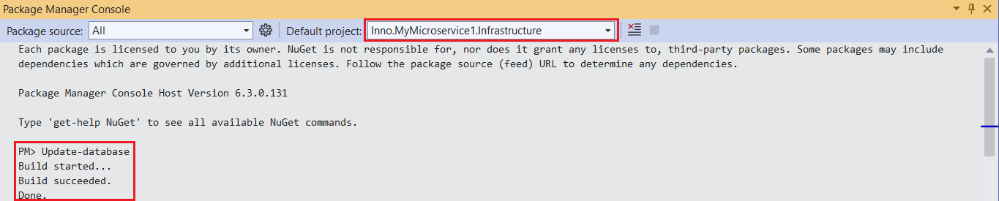

#### 6 Запустить проект (F5), в результате отобразиться окно **Swagger** с реализованными операциями **PUT**, **POST**, **DELETE**, **GET**.

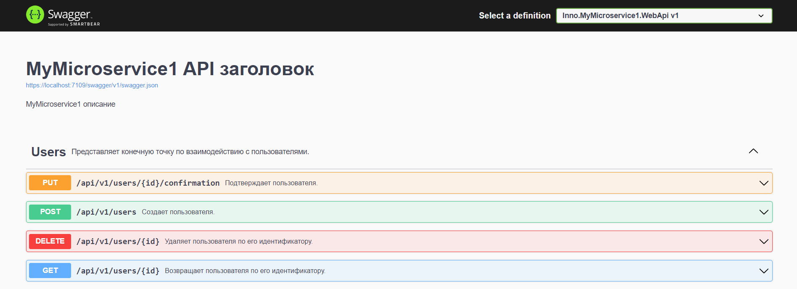

## Известные проблемы

### Проблема 1 **Solution Folder**.

#### В текущей реализации шаблон проекта **не умеет** создавать **Solution Folder**, поэтому их придется создать руками: **правый клик на имени решения - Add - New Solution Folder**. Необходимо создать следующие папки: **Domain**, **Application**, **Infrastructure**, **Tests** и разместить в них соответствующие проекты. В результате создания папок и структурирования проектов, **Solution Explorer** должен выглядеть так:

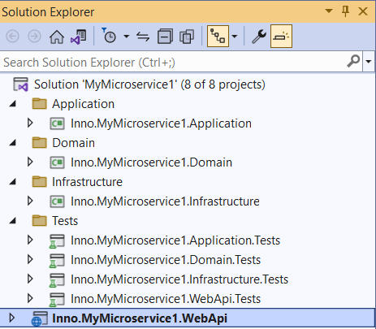

### Проблема 2 **.editorconfig**.

#### В текущей реализации шаблон проекта **не добавляет** файл **.editorconfig**, поэтому его необходимо добавить руками: **правый клик на имени решения - Add - Existing Item...** в появившемся окне выбираем файл **.editorconfig** (файл должен быть расположен рядом с файлом **.sln**).

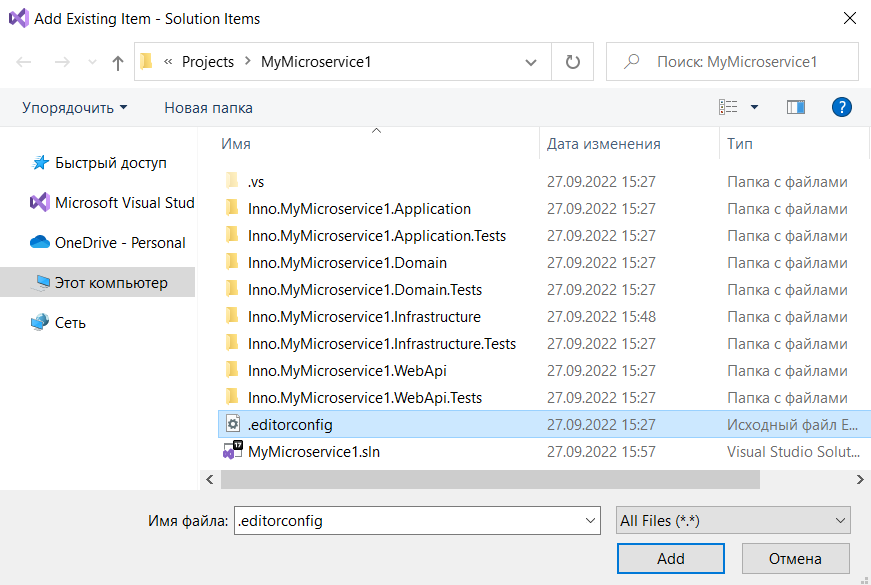

После добавления в **Solution Explorer** должна будет создаться папка **Solution Items**, в которой данный файл будет размещен.

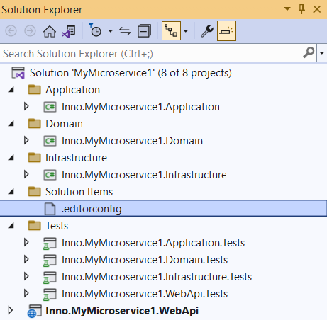
